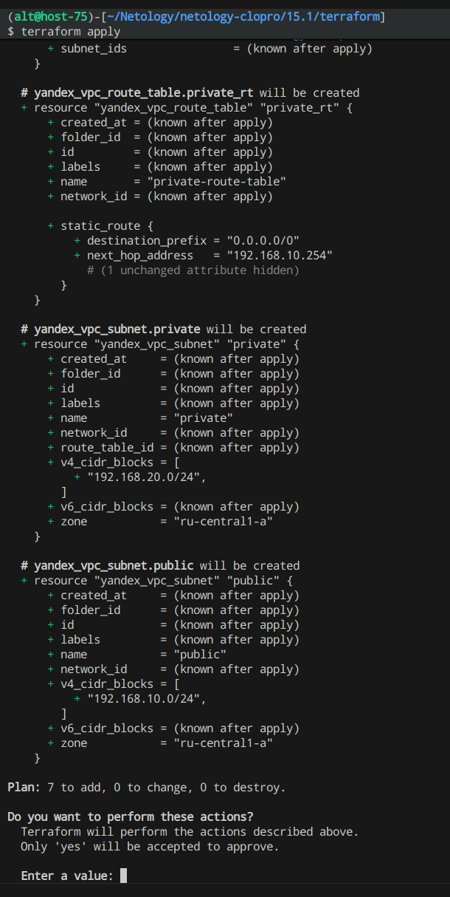
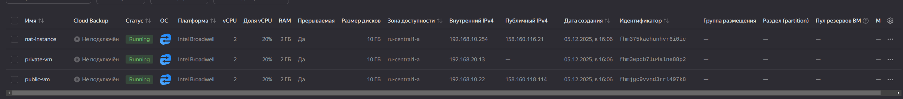
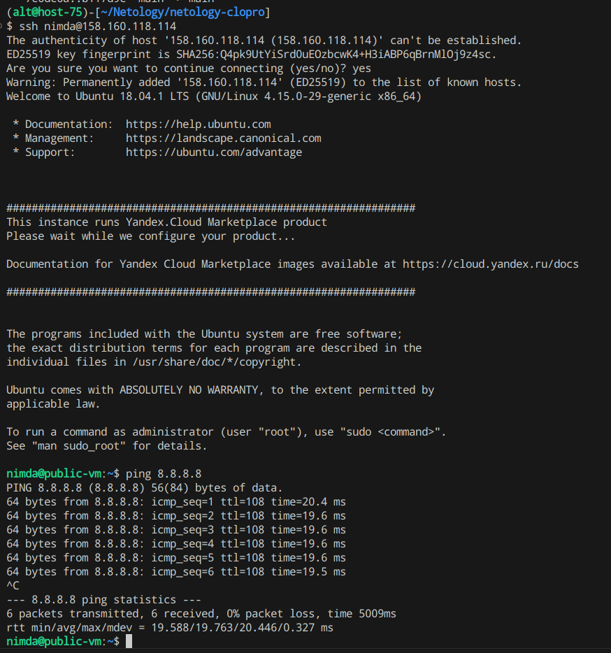
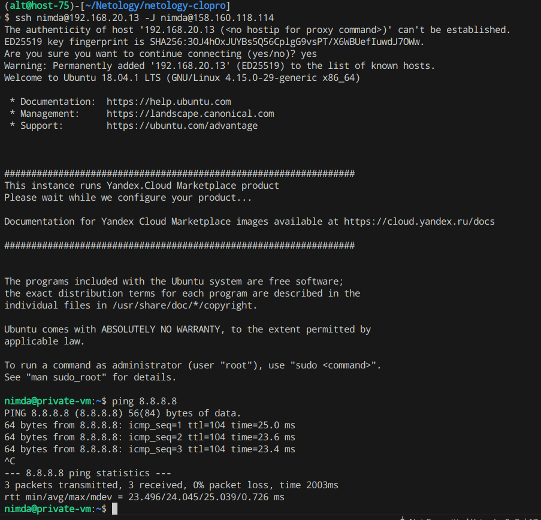

# Домашнее задание к занятию «Организация сети» - `Горелов Николай`


```bash
terraform init
terraform apply
```




[network](./terraform/network.tf)
[instance](./terraform/main.tf)

  
  
  

[terraform_folder](./terraform/)
