# Домашнее задание к занятию «Вычислительные мощности. Балансировщики нагрузки»  - `Горелов Николай`

## Решение 1. Yandex Cloud 

1. Создан backet и картинка в нём:  

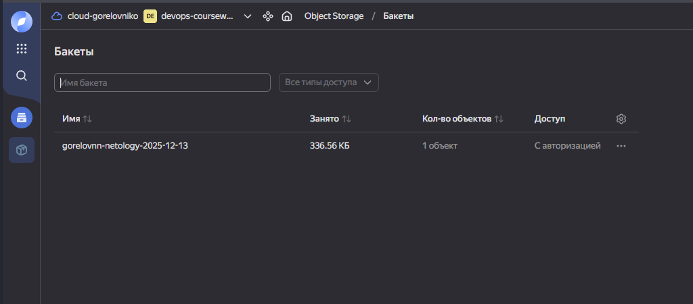  
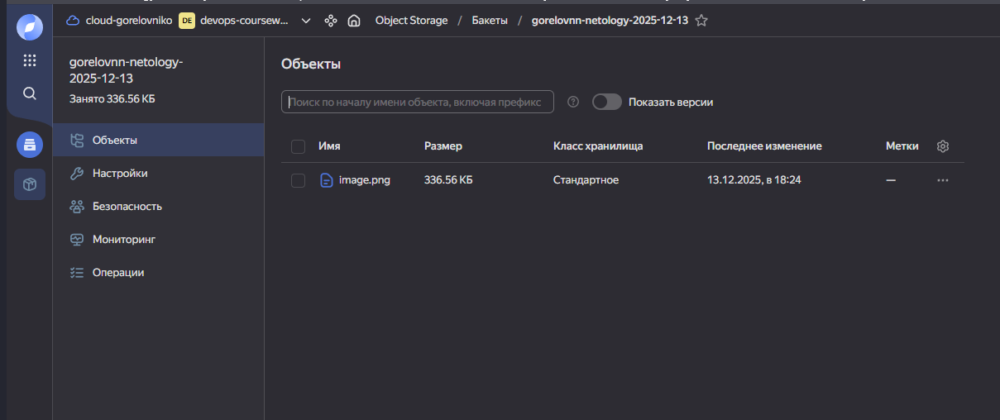  

[s3](./terraform/s3.tf)

2. Создана группа ВМ в public подсети фиксированного размера с шаблоном LAMP и веб-страницей, содержащей ссылку на картинку из бакета:

[instance-group](./terraform/instance-group.tf) 

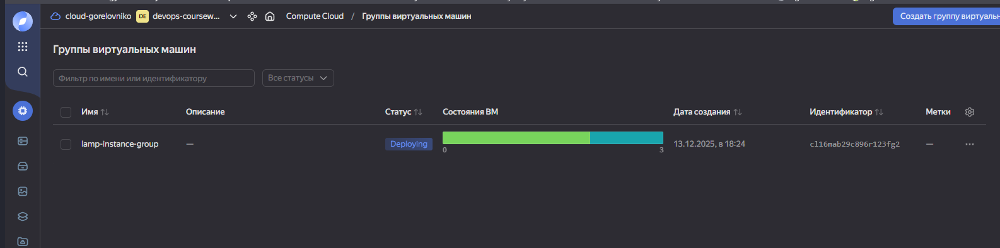  

Веб-страница:  
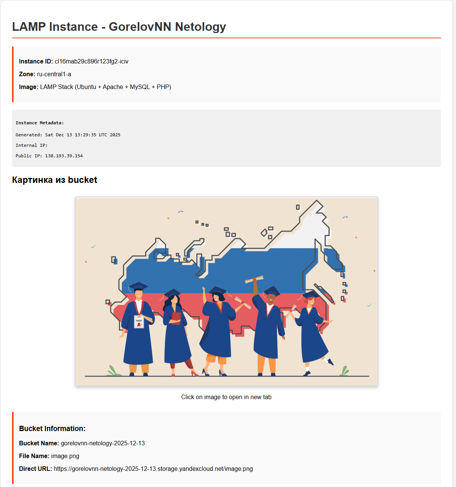  

3. Подключена группа к сетевому балансировщику:

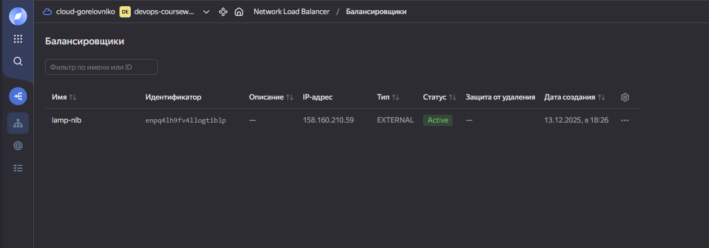  
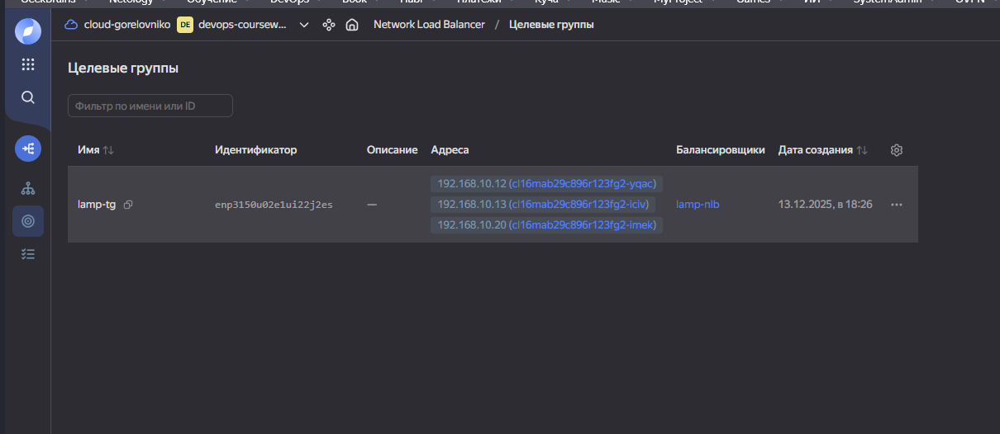  

Удалил машину, через некоторое время началось создание новой:

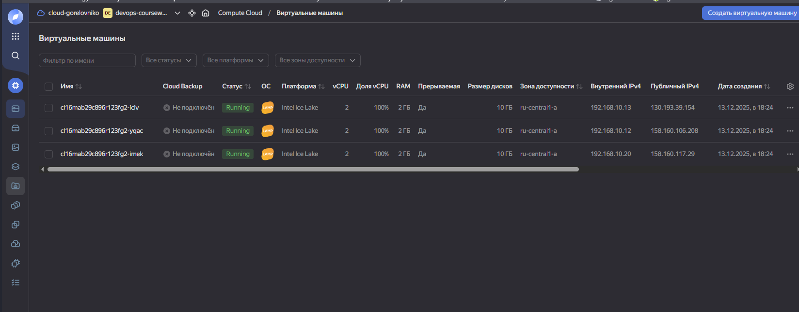  
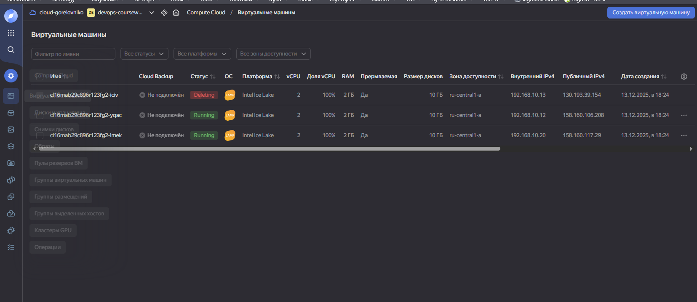  
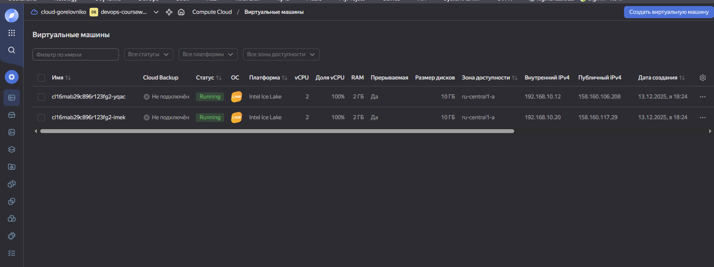  
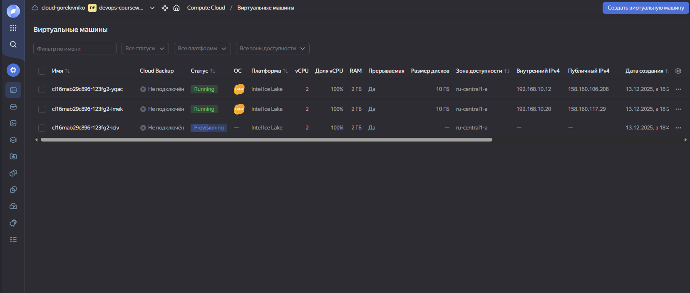  

Балансировщик отреагировал на удаление ВМ и переключил страницу:  

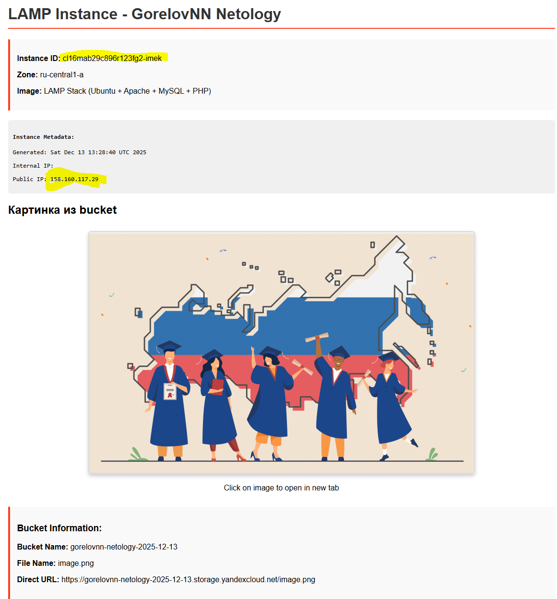  

Цели достигнуты!!!
