# Домашнее задание к занятию «Безопасность в облачных провайдерах» - `Горелов Николай`

## Решение 1. Yandex Cloud  

1. Создаем ключ и шифруем содержимое bucket:

[s3](./terraform/s3.tf)

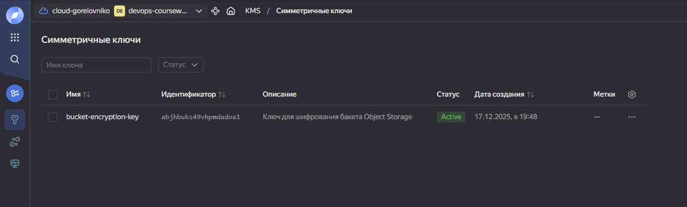

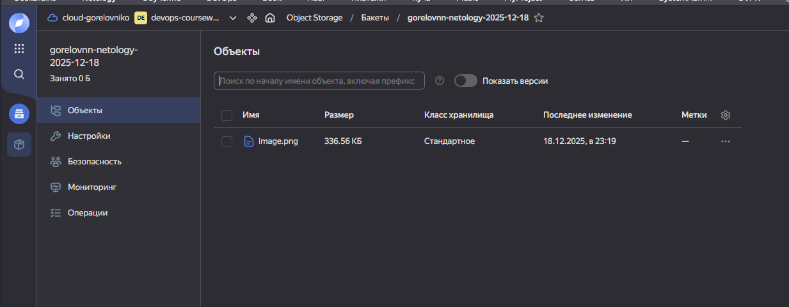

---

2. Создаем статический сайт в Object Storage c собственным публичным адресом и сделаем доступным по HTTPS:

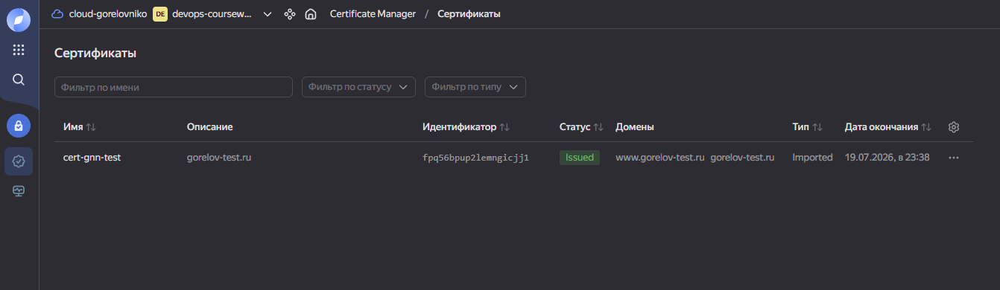  
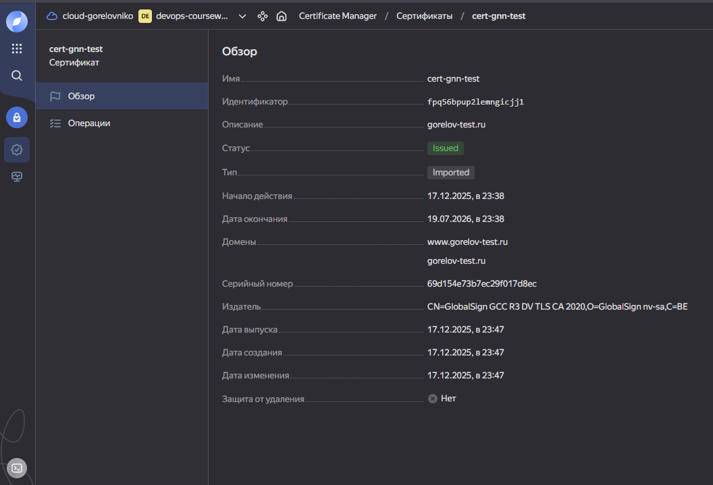  
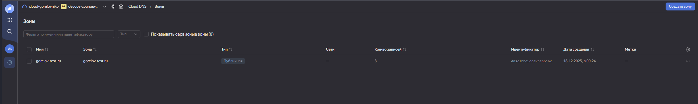  
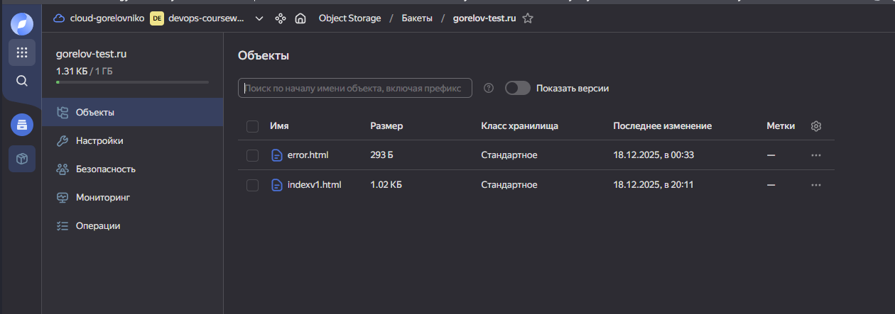  
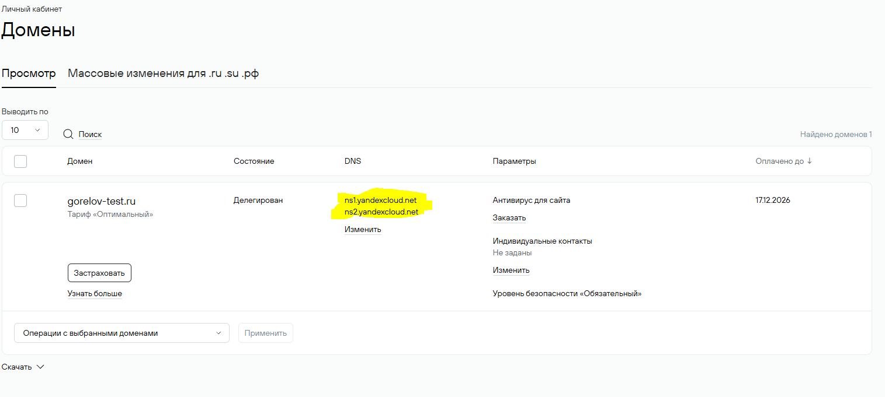  
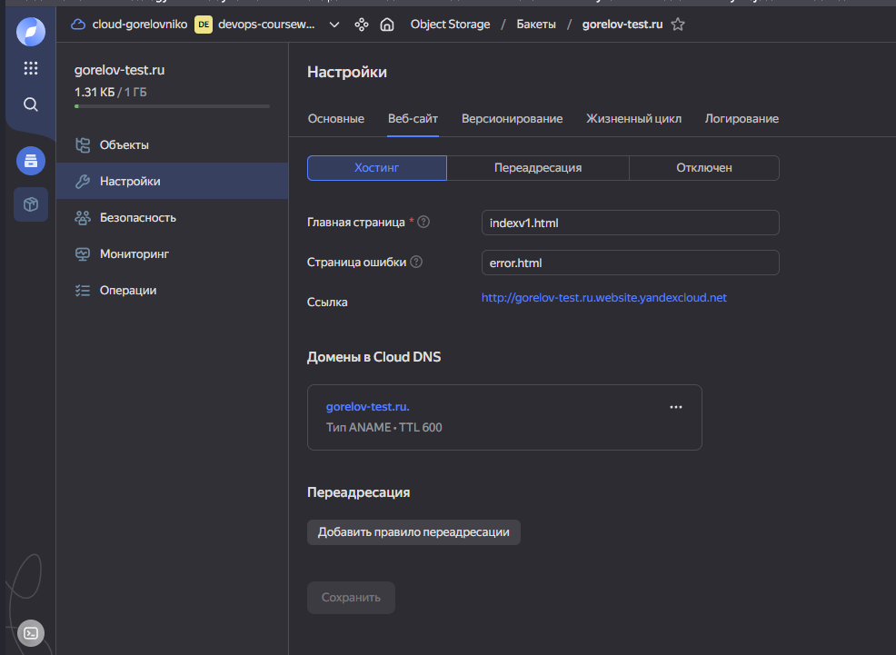  
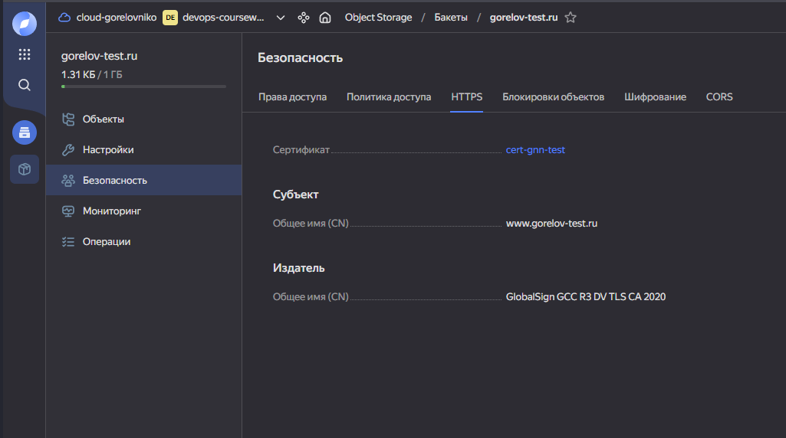  
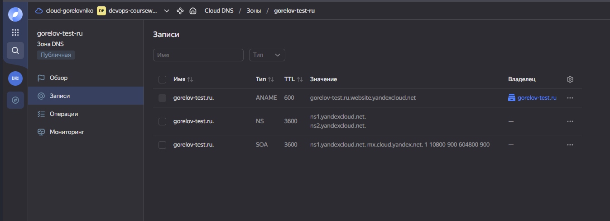  
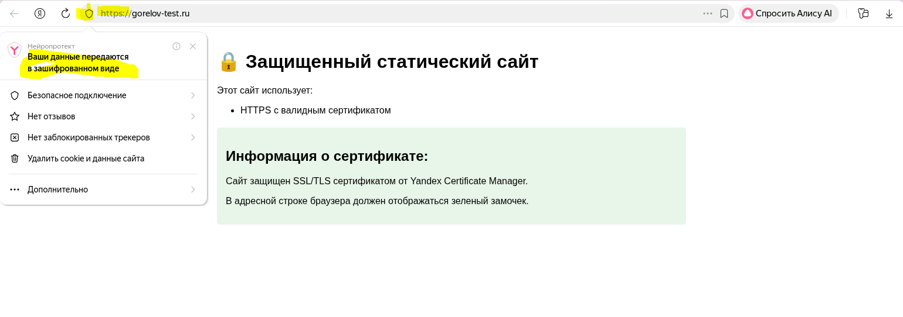  

---